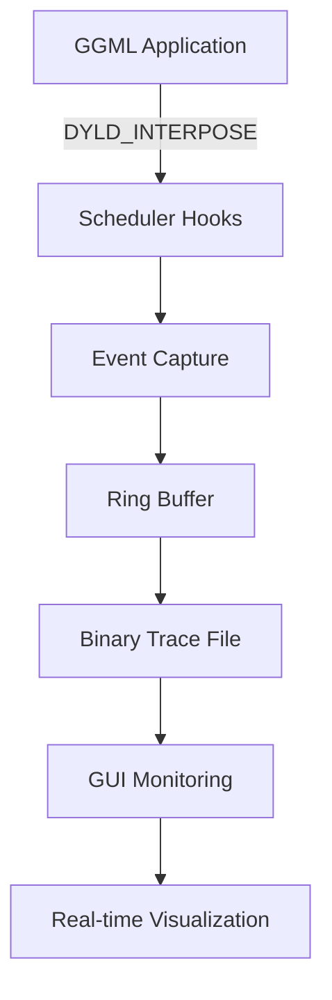

# GGML Visualizer

> **A cross-platform, real-time dashboard for visualizing GGML-based LLM runtimes like llama.cpp and whisper.cpp with Metal, CUDA, and CPU backend support.**

---

## 🚀 Quick Start (2 Minutes)

### Prerequisites

```bash
# macOS
brew install cmake glfw

# Ubuntu/Debian
sudo apt update && sudo apt install -y git cmake build-essential libgl1-mesa-dev libxinerama-dev libxcursor-dev libxi-dev libxrandr-dev
```

### Build

```bash
git clone --recursive https://github.com/your-org/ggml-visualizer
cd ggml-visualizer
mkdir build && cd build

# macOS (Metal disabled due to shader issues)
cmake .. -DCMAKE_BUILD_TYPE=Release -DGGML_METAL=OFF
make -j4

# Linux
cmake .. -DCMAKE_BUILD_TYPE=Release
make -j$(nproc)
```

### Test the Installation

```bash
# Verify build
./bin/ggml-viz --version
./bin/ggml-viz --help

# Run basic test
./tests/manual/test_ggml_hook

# Load sample trace file
./bin/ggml-viz tests/assets/test_trace.ggmlviz
```

---

## 📖 Complete Tutorial

### Method 1: External Hook Injection (Recommended)

This method works with **any existing llama.cpp installation** without recompiling.

#### Step 1: Download a Test Model
```bash
# Download a small model for testing
mkdir -p models && cd models
wget https://huggingface.co/microsoft/DialoGPT-medium/resolve/main/pytorch_model.bin
# Or use any .gguf model you have
```

#### Step 2: Start the GUI (Terminal 1)
```bash
# Start GUI in live mode, monitoring trace.ggmlviz
./bin/ggml-viz --live tests/traces/trace.ggmlviz --no-hook --verbose
```

You should see:
```
[ImGuiApp] Live mode enabled with built-in hook disabled (--no-hook)
[ImGuiApp] Monitoring specified trace file: tests/traces/trace.ggmlviz
```

#### Step 3: Run llama.cpp with Hooks (Terminal 2)
```bash
# Set environment variables
export GGML_VIZ_OUTPUT=tests/traces/trace.ggmlviz
export DYLD_INSERT_LIBRARIES=build/src/libggml_viz_hook.dylib

# Run any llama.cpp binary with hooks
./third_party/llama.cpp/build/bin/llama-cli \
  -m models/your-model.gguf \
  -p "Hello, world!" \
  -n 10 \
  --no-display-prompt
```

#### Step 4: Watch Real-Time Visualization
The GUI automatically updates as events are captured. You should see:
- **Hook Output**: `[GGML_VIZ] *** SCHEDULER INTERPOSED ***` messages
- **GUI Updates**: `[ImGuiApp] Loaded X new events from external file`
- **Live Dashboard**: Real-time graph and timeline visualization

### Method 2: Direct Integration (Advanced)

For custom GGML applications or development purposes.

#### Step 1: Link Against ggml-viz
```cmake
# In your CMakeLists.txt
find_package(ggml_viz REQUIRED)
target_link_libraries(your_app ggml_viz_hook)
```

#### Step 2: Initialize in Code
```cpp
#include "ggml_hook.hpp"

int main() {
    // Start instrumentation
    auto& hook = ggml_viz::GGMLHook::instance();
    hook.start();
    
    // Your GGML code here
    ggml_graph_compute(ctx, graph);
    
    // Stop instrumentation
    hook.stop();
    return 0;
}
```

#### Step 3: Set Output and Run
```bash
export GGML_VIZ_OUTPUT=my_trace.ggmlviz
./your_app

# Visualize results
./bin/ggml-viz my_trace.ggmlviz
```

---

## 🛠 Advanced Usage

### Live Mode with Custom File Paths
```bash
# Terminal 1: GUI monitoring specific file
./bin/ggml-viz --live /path/to/my_trace.ggmlviz --no-hook

# Terminal 2: Application writing to same file
export GGML_VIZ_OUTPUT=/path/to/my_trace.ggmlviz
export DYLD_INSERT_LIBRARIES=build/src/libggml_viz_hook.dylib
./your_ggml_app
```

### Web Server Mode (Experimental)
```bash
# Start web server
./bin/ggml-viz --web --port 8080

# Access dashboard at http://localhost:8080
```

### Batch Processing Multiple Traces
```bash
# Process all traces in directory
for trace in tests/traces/*.ggmlviz; do
    echo "Processing $trace..."
    ./bin/ggml-viz "$trace" --export-stats
done
```

### Performance Benchmarking
```bash
# Quick performance check
./scripts/simple_benchmark.sh

# Detailed benchmarking with overhead measurement
./scripts/benchmark.sh
```

**Performance Impact**: Benchmarking shows **< 5% overhead** with negligible memory impact. See [PERFORMANCE_REPORT.md](PERFORMANCE_REPORT.md) for detailed analysis.

---

## 🎯 Environment Variables

### Essential Variables
- **`GGML_VIZ_OUTPUT`**: Output trace file path (required for capture)
- **`DYLD_INSERT_LIBRARIES`**: macOS library injection path
- **`LD_PRELOAD`**: Linux library injection path (when available)

### Configuration Variables
- **`GGML_VIZ_VERBOSE`**: Enable verbose logging output
- **`GGML_VIZ_DISABLE`**: Disable instrumentation entirely  
- **`GGML_VIZ_MAX_EVENTS`**: Maximum events to capture (default: 10,000,000)

### Advanced Debugging
- **`GGML_VIZ_OP_TIMING`**: Enable operation timing (default: true)
- **`GGML_VIZ_MEMORY_TRACKING`**: Enable memory tracking (default: false)
- **`GGML_VIZ_THREAD_TRACKING`**: Enable thread tracking (default: false)
- **`GGML_VIZ_TENSOR_NAMES`**: Capture tensor names (default: true)

---

## 📊 Understanding the Output

### Trace File Format
Generated `.ggmlviz` files contain:
- **Header**: Magic bytes "GGMLVIZ1" + metadata
- **Events**: Binary event stream with timestamps
- **Statistics**: Performance metrics and summaries

### Event Types Captured
- **Graph Compute**: Begin/end of graph execution
- **Operation Timing**: Individual operation performance
- **Memory Events**: Allocation/deallocation tracking
- **Backend Events**: GPU kernel launches and synchronization

### GUI Components
- **Timeline View**: Flame chart showing operation execution
- **Graph View**: Static computation graph visualization  
- **Memory View**: Memory usage and allocation patterns
- **Statistics Panel**: Performance metrics and bottlenecks

---

## 🔧 Troubleshooting

### Common Issues

#### "No events captured"
```bash
# Check if hooks are loaded
export GGML_VIZ_VERBOSE=1
# Look for "[GGML_VIZ] Hook started" messages
```

#### "Failed to read trace header"
```bash
# Verify file exists and has correct format
hexdump -C your_trace.ggmlviz | head -1
# Should start with: 47 47 4d 4c 56 49 5a 31 (GGMLVIZ1)
```

#### macOS "Library not loaded"
```bash
# Fix library path
export DYLD_INSERT_LIBRARIES=$(pwd)/build/src/libggml_viz_hook.dylib
# Use absolute path instead of relative
```

#### GUI not updating in live mode
```bash
# Ensure both processes use the same file path
./bin/ggml-viz --live trace.ggmlviz --no-hook  # Terminal 1
export GGML_VIZ_OUTPUT=trace.ggmlviz           # Terminal 2
```

### Debug Commands
```bash
# Test hook system
./tests/manual/test_ggml_hook

# Verify library symbols
nm build/src/libggml_viz_hook.dylib | grep viz_sched

# Check file permissions
ls -la tests/traces/trace.ggmlviz

# Monitor file changes
tail -f tests/traces/trace.ggmlviz
```

---

## 🏗 Architecture

### Core Components



- **Scheduler Interposition**: DYLD_INTERPOSE for guaranteed symbol replacement
- **Event Capture**: Lock-free ring buffer for high-performance recording (< 5% overhead)
- **Binary Format**: Efficient `.ggmlviz` format with version headers
- **Live Monitoring**: File-based communication between processes
- **Cross-Platform**: Works with Metal, CUDA, CPU, and Vulkan backends

### Supported Platforms

| Platform | CPU | GPU | Hook Method | Status |
|----------|-----|-----|-------------|---------|
| macOS (arm64/x64) | ✅ AVX2/NEON | ✅ Metal* | DYLD_INTERPOSE | ✅ Production |
| Linux (x64) | ✅ AVX2/AVX-512 | ✅ CUDA/Vulkan | LD_PRELOAD | 🛠 In Progress |
| Windows 10+ | ✅ AVX2 | ✅ CUDA/DirectML | DLL Injection | ❌ Planned |
| Raspberry Pi | ✅ NEON | ❌ | LD_PRELOAD | 🛠 Limited |

*Metal backend requires `-DGGML_METAL=OFF` due to shader compilation issues

---

## 🧪 Development

### Running Tests
```bash
# Unit tests
cd build && ctest

# Manual tests
./tests/manual/test_ggml_hook
./tests/manual/test_interpose

# Integration tests
./tests/integration/demo_live_mode_with_llama.sh
```

### Contributing

1. **Fork the repository** and create a feature branch
2. **Follow the coding style** (clang-format configuration included)
3. **Add tests** for new functionality
4. **Update documentation** for user-facing changes
5. **Submit a pull request** with clear description

### Development Commands
```bash
# Format code
./scripts/format.sh

# Run linting
./scripts/lint.sh

# Build with debug symbols
cmake .. -DCMAKE_BUILD_TYPE=Debug -DGGML_METAL=OFF
make -j4

# Test with verbose output
./bin/ggml-viz --verbose tests/traces/trace.ggmlviz
```

---

## 📝 Status & Roadmap

### ✅ **Working (Production Ready)**
- ✅ External hook injection via DYLD_INTERPOSE
- ✅ Scheduler interposition for modern llama.cpp
- ✅ Real-time trace file generation and monitoring
- ✅ ImGui desktop visualization interface
- ✅ Binary trace format with version headers
- ✅ Cross-backend support (Metal, CPU, CUDA, Vulkan)
- ✅ Live mode with file-based communication
- ✅ Comprehensive CLI with --help, --version, --no-hook

### 🛠 **In Progress**
- 🛠 Linux LD_PRELOAD support
- 🛠 Advanced timeline visualization
- 🛠 Tensor inspection and statistics
- 🛠 Memory usage tracking

### 📋 **Planned**
- 📋 Windows DLL injection support  
- 📋 Web dashboard (browser-based interface)
- 📋 Plugin system for custom visualizations
- 📋 Export capabilities (SVG, JSON, CSV)
- 📋 Integration with profiling tools (Tracy, perf)

---

## 📄 License

Licensed under **Apache 2.0**. See [LICENSE](LICENSE) for details.

Third-party dependencies are listed in [docs/THIRD_PARTY.md](docs/THIRD_PARTY.md).

---

## 🙏 Credits

- **Georgi Gerganov** and the GGML community for the foundation
- **llama.cpp contributors** for the excellent inference engine
- **ImGui team** for the immediate mode GUI framework
- **Tracy profiler** for real-time profiling inspiration

---

*"The best way to understand your model is to watch it run."*