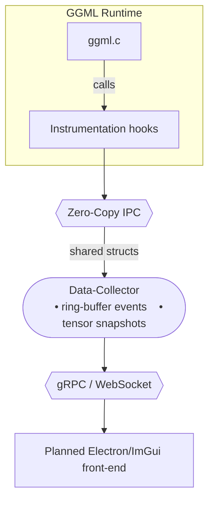

# GGML Visualizer

> **A cross‑platform, real‑time dashboard that lets you *****see***** whatʼs happening inside any GGML‑based runtime — from **`llama.cpp`** on a Raspberry Pi to **`whisper.cpp`** on an M3 Max.**

---

## 1 • Why does this exist?

Low‑level LLM runtimes like **GGML** squeeze every last drop of performance out of CPUs and GPUs, but they are effectively a black box once the code is running.  Developers currently debug with `printf()` and perf logs — painful and time‑consuming. **GGML Visualizer** removes that friction:

- **Graph view** – static compute graph visualization with operation details
- **Timeline view** – flame‑chart showing kernel launches, thread utilisation, cache misses, and memory transfers (planned)
- **Tensor inspector** – peek at activations, histograms, min/max, sparsity, quantisation buckets (planned)
- **Attention heat‑map** – for transformer models, display token‑by‑token attention scores (planned)
- **Memory arena explorer** – visualise GGMLʼs bump‑allocator, fragmentation, and live/peak usage (planned)

---

## 2 • Features at a glance

| Category          | Feature                                            | Status    |
| ----------------- | -------------------------------------------------- | --------- |
| **Graph**         | Static compute graph visualization                 | ✅ Ready   |
|                   | Static graph import (`ggml_graph_dump_dot`)        | ✅ Ready   |
| **Timeline**      | CPU & GPU kernel flame‑chart                       | ❌ Planned |
| **Tensors**       | On‑hover statistics (mean/σ, sparsity)             | ❌ Planned |
|                   | Slice & heat‑map viewer                            | ❌ Planned |
| **Memory**        | Live arena visual + peak tracker                   | ❌ Planned |
| **Model‑aware**   | Transformer attention & KV‑cache heat‑maps         | ❌ Planned |
| **Extensibility** | Plugin SDK (C++)                                   | ❌ Planned |

Legend: ✅ = production‑ready · 🛠 = usable but polishing · ❌ = stub / not started

---

## 3 • Quick start (90 seconds)

### 3.1 Install prerequisites

```bash
# Ubuntu / Debian
sudo apt update && sudo apt install -y git cmake build-essential libgl1-mesa-dev libxinerama-dev libxcursor-dev libxi-dev libxrandr-dev

# macOS (Apple Silicon & Intel)
brew install cmake glfw
```

### 3.2 Build

```bash
git clone --recursive [REPOSITORY_URL_TBD]
cd ggml‑visualizer
mkdir build && cd build

# macOS (recommended due to Metal shader issues)
cmake .. -DCMAKE_BUILD_TYPE=Release -DGGML_METAL=OFF

# Linux/Ubuntu
cmake .. -DCMAKE_BUILD_TYPE=Release

make -j4
```

### 3.3 Capture and visualize llama.cpp

```bash
# Step 1: Set environment variable for trace capture
export GGML_VIZ_OUTPUT=my_llama_trace.ggmlviz

# Step 2: Run llama.cpp normally (hooks auto-capture GGML events)
/path/to/llama.cpp/main -m /path/to/model.gguf -p "Hello, world!" -n 50

# Step 3: Visualize the captured data
./bin/ggml-viz my_llama_trace.ggmlviz
```

The dashboard opens automatically showing the captured inference data. For more options:

```bash
# Show help with all available options
./bin/ggml-viz --help

# Load existing trace file
./bin/ggml-viz tests/traces/trace.ggmlviz

# Enable verbose output
./bin/ggml-viz --verbose tests/traces/trace.ggmlviz

# Live mode (experimental - not fully implemented)
./bin/ggml-viz --live --port 8080
```

---

## 4 • Architecture



- **Instrumentation hooks** – small patch (\~200 LOC) to GGML that triggers a callback before/after each op; can be upstreamed.
- **Zero‑Copy IPC** – POSIX shared memory on Unix, `CreateFileMapping` on Windows (planned).
- **Front‑end** – Desktop ImGui build (ready) or optional Electron client for web dashboards (planned).

---

## 5 • Supported platforms & back‑ends

| OS / Arch                  | CPU (AVX2 / AVX‑512 / NEON) | GPU (Metal / CUDA / Vulkan) | Status |
| -------------------------- | --------------------------- | --------------------------- | ------ |
| macOS 12+ (arm64, x86\_64) | ✔︎                          | CPU only*                   | ✅      |
| Linux (x86\_64)            | ✔︎                          | CUDA 11+, Vulkan            | ✅      |
| Windows 10+                | ✔︎                          | Untested                     | ❌     |
| Raspberry Pi 5             | ✔︎ (NEON)                   | —                           | 🛠     |

*Metal backend disabled by default due to shader compilation issues

Performance overhead: ~1-2% (preliminary - see [BENCHMARKING.md](docs/BENCHMARKING.md) for details and critical issues).

**Recent Fix**: Critical bug resolved - instrumentation now properly records events (was recording 0 events, now records 60+ events per test run).

---

## 6 • Roadmap (2025‑Q3)

- **0.2.0** – Full CPU timeline, tensor heat‑maps, KV‑cache view ✨
- **0.3.0** – GPU kernel correlation (Metal & CUDA), quant‑bucket viewer
- **0.4.0** – Plugin SDK v1 + Python bindings
- **0.5.0** – Attention & router head visualizer, export to SVG/JSON

See [`docs/CHANGELOG.md`](docs/CHANGELOG.md) for granular history.

---

## 7 • Contributing

1. **Pick an issue** tagged `good‑first‑issue` or `help‑wanted`.
2. Fork → feature branch → PR. Code formatting and linting TBD.
3. Each PR must pass tests (CI setup TBD).
4. Follow project guidelines (contributor agreement TBD).

We especially welcome:

- **UI/UX polishers** (ImGui, Dear ImGui Docking, Electron)
- **GPU devs** – Metal shaders & CUDA kernel tracing
- **Model folk** – attention/KV‑cache interpretation modules

---

## 8 • Quick reference

### Build and test commands:
```bash
# Build (macOS)
mkdir -p build && cd build
cmake .. -DCMAKE_BUILD_TYPE=Release -DGGML_METAL=OFF
make -j4

# Test
./tests/manual/test_ggml_hook
./bin/test_trace_reader tests/assets/test_trace.ggmlviz

# Run visualizer
./bin/ggml-viz --help
```

### Environment variables:
- `GGML_VIZ_OUTPUT`: Output trace file (required for capture)
- `GGML_VIZ_VERBOSE`: Enable verbose logging
- `GGML_VIZ_DISABLE`: Disable instrumentation entirely

### Performance benchmarking:
```bash
# Quick performance check
./scripts/simple_benchmark.sh

# Comprehensive analysis
./scripts/benchmark.sh
```

---

## 9 • License

`ggml‑visualizer` is licensed under the **Apache 2.0** license. See `docs/THIRD_PARTY.md` for dependency licenses.

---

## 10 • Credits & Inspiration

- Georgi Gerganov and the **GGML** community for the blazing‑fast runtime.
- Anthropicʼs **Neuronpedia** and Metaʼs **LLM Transparency Tool** for paving the way in model interpretability.
- **Tracy** profiler for showing that real‑time, low‑overhead visualisation is possible in C++.

*"The best debugger is a graphical one you can keep open while your model runs."* – Me

---

## Implementation Status Summary

### ✅ **Working Components**
- **Core instrumentation** - Complete GGML hook infrastructure with event capture
- **Auto-initialization** - Environment variable configuration system
- **Main executable** - Full CLI argument parsing with help, version, validation
- **ImGui frontend** - Desktop UI with trace file loading capability
- **Custom ImGui widgets** - Graph visualization, timeline, inspection widgets
- **Trace reader** - Binary .ggmlviz file parsing and event replay

### 🛠 **Partially Implemented**  
- **Injection scripts** - macOS/Linux dynamic library injection helpers
- **Live mode** - CLI option exists but functionality not fully implemented
- **Configuration loading** - CLI option exists but not implemented

### ❌ **Empty Stubs Requiring Implementation**
- **IPC layer** - Cross-platform shared memory (POSIX/Windows)
- **Plugin system** - Dynamic loading API and plugin loader
- **gRPC server** - Remote API for live data access
- **Advanced visualizations** - Timeline, tensor stats, memory tracking
- **Development tools** - Linting, formatting, and test execution scripts

### 🚀 **Current Usability**
The instrumentation core is production-ready. You should be able to instrument any GGML application by setting `GGML_VIZ_OUTPUT`, generate .ggmlviz trace files, and visualize them in the desktop UI. If this isn't the case, please contact the maintainers (Will Brodhead). The CLI is fully functional with comprehensive help and validation.

### 📦 **Project Structure & Submodules**

The project is organized with a modular architecture using git submodules for external dependencies:

#### **Git Submodules**
- **`third_party/ggml`** - Fork of GGML tensor library with backend hooks ([brodheadw/willb-ggml](https://github.com/brodheadw/willb-ggml))
- **`third_party/llama.cpp`** - Fork with Metal backend hooks ([brodheadw/llama.cpp](https://github.com/brodheadw/llama.cpp))
- **`third_party/glfw`** - OpenGL window management (upstream)
- **`third_party/imgui`** - Immediate mode GUI framework (upstream)

#### **Metal Backend Integration**
The llama.cpp submodule uses a custom fork with visualization hooks:
- **Branch**: `ggml-viz-hooks` 
- **Modifications**: Universal backend interception at `ggml_backend_graph_compute()`
- **Coverage**: All backends (Metal, CPU, CUDA, Vulkan) through single integration point
- **Compatibility**: Weak symbols allow dynamic library injection without code changes