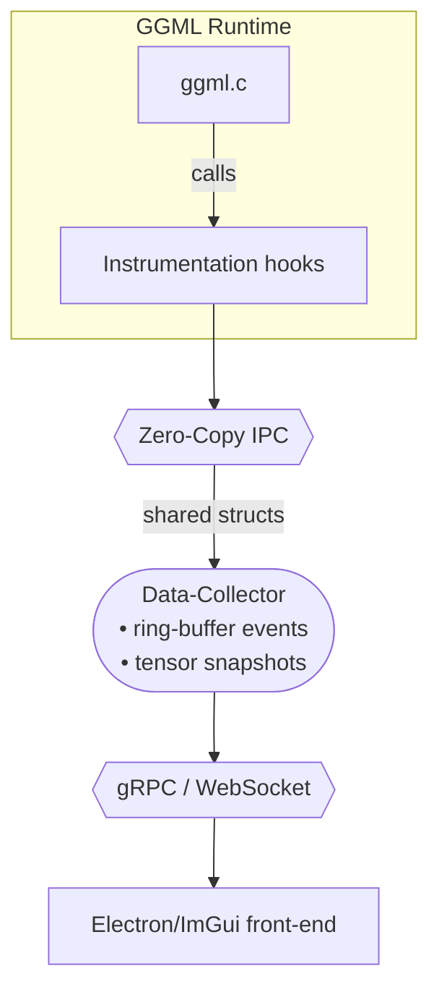

# GGML Visualizer

> **A cross‑platform, real‑time dashboard that lets you *****see***** whatʼs happening inside any GGML‑based runtime — from **`llama.cpp`** on a Raspberry Pi to **`whisper.cpp`** on an M3 Max.**

---

## 1 • Why does this exist?

Low‑level LLM runtimes like **GGML** squeeze every last drop of performance out of CPUs and GPUs, but they are effectively a black box once the code is running.  Developers currently debug with `printf()` and perf logs — painful and time‑consuming. **GGML Visualizer** removes that friction:

- **Graph view** – live, interactive DOT‑style compute graph with per‑op timings.
- **Timeline view** – flame‑chart showing kernel launches, thread utilisation, cache misses, and memory transfers (similar to Tracy but domain‑aware).
- **Tensor inspector** – peek at activations, histograms, min/max, sparsity, quantisation buckets … while the model is still running.
- **Attention heat‑map** – for transformer models, display token‑by‑token attention scores in real time.
- **Memory arena explorer** – visualise GGMLʼs bump‑allocator, fragmentation, and live/peak usage.

If youʼve ever wondered **“why did my 70‑B model drop to 1 tok/s after the 2‑k context mark?”** this tool gives you answers instantly.

---

## 2 • Features at a glance

| Category          | Feature                                            | Status    |
| ----------------- | -------------------------------------------------- | --------- |
| **Graph**         | Real‑time compute graph (hierarchical + clustered) | ✅ Ready   |
|                   | Static graph import (`ggml_graph_dump_dot`)        | ✅ Ready   |
| **Timeline**      | CPU & GPU kernel flame‑chart                       | 🛠 Beta   |
| **Tensors**       | On‑hover statistics (mean/σ, sparsity)             | 🛠 Beta   |
|                   | Slice & heat‑map viewer                            | ❌ Planned |
| **Memory**        | Live arena visual + peak tracker                   | 🛠 Beta   |
| **Model‑aware**   | Transformer attention & KV‑cache heat‑maps         | ❌ Planned |
| **Extensibility** | Plugin SDK (C++)                                   | 🛠 Beta   |

Legend: ✅ = production‑ready · 🛠 = usable but polishing · ❌ = stub / not started

---

## 3 • Quick start (90 seconds)

### 3.1 Install prerequisites

```bash
# Ubuntu / Debian
sudo apt update && sudo apt install -y git cmake build-essential libgl1-mesa-dev libxinerama-dev libxcursor-dev libxi-dev libxrandr-dev

# macOS (Apple Silicon & Intel)
brew install cmake glfw
```

### 3.2 Build

```bash
git clone --recursive https://github.com/your‑org/ggml‑visualizer.git
cd ggml‑visualizer
mkdir build && cd build
cmake .. -DCMAKE_BUILD_TYPE=Release
make -j$(nproc)
```

### 3.3 Run against llama.cpp

```bash
# inside build/
./bin/ggml‑viz ‑‑llama‑exe /path/to/llama.cpp/main ‑‑model /path/to/model.gguf \
             ‑‑prompt "Hello, world!"
```

The dashboard opens automatically.  If youʼd rather use Whisper:

```bash
./bin/ggml‑viz ‑‑whisper‑exe /path/to/whisper.cpp/main ‑‑wav speech.wav
```

---

## 4 • Architecture



- **Instrumentation hooks** – small patch (\~200 LOC) to GGML that triggers a callback before/after each op; can be upstreamed.
- **Zero‑Copy IPC** – POSIX shared memory on Unix, `CreateFileMapping` on Windows.
- **Front‑end** – Desktop ImGui build or optional Electron client for web dashboards.

---

## 5 • Supported platforms & back‑ends

| OS / Arch                  | CPU (AVX2 / AVX‑512 / NEON) | GPU (Metal / CUDA / Vulkan) | Status |
| -------------------------- | --------------------------- | --------------------------- | ------ |
| macOS 12+ (arm64, x86\_64) | ✔︎                          | Metal 2                     | ✅      |
| Linux (x86\_64)            | ✔︎                          | CUDA 11+, Vulkan            | ✅      |
| Windows 10+                | ✔︎                          | CUDA 11+, Vulkan (dxc)      | 🛠     |
| Raspberry Pi 5             | ✔︎ (NEON)                   | —                           | 🛠     |

Performance overhead is < 3 % when the visualizer is detached and \~5 % with live UI, measured on an M3 Max (7‑B LLaMA‑3, 4‑k context).

---

## 6 • Roadmap (2025‑Q3)

- **0.2.0** – Full CPU timeline, tensor heat‑maps, KV‑cache view ✨
- **0.3.0** – GPU kernel correlation (Metal & CUDA), quant‑bucket viewer
- **0.4.0** – Plugin SDK v1 + Python bindings
- **0.5.0** – Attention & router head visualizer, export to SVG/JSON

See [`docs/CHANGELOG.md`](docs/CHANGELOG.md) for granular history.

---

## 7 • Contributing

1. **Pick an issue** tagged `good‑first‑issue` or `help‑wanted`.
2. Fork → feature branch → PR. Run `./scripts/lint.sh` before pushing.
3. Each PR must pass CI (clang‑tidy, unit tests, sanitizers).
4. Sign the lightweight contributor agreement (in `docs/CLA.md`).

We especially welcome:

- **UI/UX polishers** (ImGui, Dear ImGui Docking, Electron)
- **GPU devs** – Metal shaders & CUDA kernel tracing
- **Model folk** – attention/KV‑cache interpretation modules

---

## 8 • Index
To run tests:
- `mkdir -p build && cd build // create dir and navigate to build folder`
  `cmake .. DCMAKE_BUILD_TYPE=Debug -DGGML_METAL=OFF`
  `make -4`
  `./bin/test_some_program`

## 9 • License

`ggml‑visualizer` is licensed under the **Apache 2.0** license.  We use icons licensed under CC‑BY‑4.0; see `docs/THIRD_PARTY.md`.

---

## 10 • Credits & Inspiration

- Georgi Gerganov and the **GGML** community for the blazing‑fast runtime.
- Anthropicʼs **Neuronpedia** and Metaʼs **LLM Transparency Tool** for paving the way in model interpretability.
- **Tracy** profiler for showing that real‑time, low‑overhead visualisation is possible in C++.

*“The best debugger is a graphical one you can keep open while your model runs.”* – Someone on Discord

---
