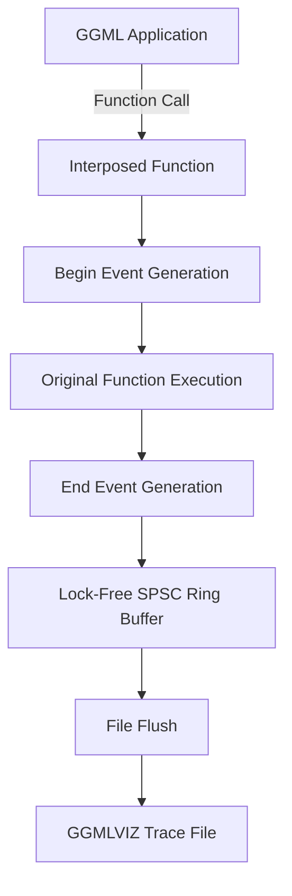

# GGMLVIZ File Format

GGMLVIZ is a binary file format for storing GGML execution traces for performance analysis and visualization. GGMLVIZ is designed for fast loading and writing of trace data, and for ease of reading. Traces are captured during GGML computation and then stored in GGMLVIZ format for analysis with ggml-viz tools.

GGMLVIZ is designed to be unambiguous by containing all the information needed to load and analyze an execution trace. It is also designed to be extensible, so that new event types and metadata can be added without breaking compatibility with existing traces.

## Specification

GGMLVIZ is a streaming binary format designed for high-performance trace capture with minimal overhead. The following features are key to its design:

- **Single-file deployment**: traces can be easily distributed and loaded, with no external dependencies
- **Streaming compatible**: events can be written incrementally during execution without buffering
- **Minimal overhead**: compact binary representation optimized for high-frequency event capture
- **Cross-platform**: consistent format across Windows, macOS, and Linux
- **Version-aware**: format versioning allows for future enhancements while maintaining backward compatibility

The key design principle is optimizing for write performance during trace capture, while maintaining reasonable read performance for analysis tools.

## File Structure

GGMLVIZ files are structured as a header followed by a stream of events. All values are stored in little-endian format. Fields are written sequentially without padding.

```c
enum ggmlviz_event_type: uint8_t {
    GGMLVIZ_EVENT_GRAPH_COMPUTE_BEGIN = 0,
    GGMLVIZ_EVENT_GRAPH_COMPUTE_END   = 1,
    GGMLVIZ_EVENT_OP_COMPUTE_BEGIN    = 2,
    GGMLVIZ_EVENT_OP_COMPUTE_END      = 3,
    GGMLVIZ_EVENT_TENSOR_ALLOC        = 4,
    GGMLVIZ_EVENT_TENSOR_FREE         = 5,
    GGMLVIZ_EVENT_BARRIER_WAIT        = 6,
    GGMLVIZ_EVENT_THREAD_BEGIN        = 7,
    GGMLVIZ_EVENT_THREAD_FREE         = 8,
};

struct ggmlviz_header_t {
    // Magic number to announce that this is a GGMLVIZ file.
    // Must be `GGMLVIZ1` at the byte level: `0x47` `0x47` `0x4D` `0x4C` `0x56` `0x49` `0x5A` `0x31`.
    char magic[8];
    
    // The version of the format implemented.
    // Must be `1` for the version described in this spec.
    // This version should only be increased for structural changes to the format.
    uint32_t version;
};

union ggmlviz_event_data_t {
    struct {
        // Pointer to the tensor being computed (for identification)
        uint64_t tensor_ptr;
        // GGML operation type (enum ggml_op)
        uint32_t op_type;
        // Size of the operation in bytes
        uint64_t op_size;
        // Pointer to the backend used (NULL for CPU)
        uint64_t backend_ptr;
    } op;
    
    struct {
        // Pointer to the computation graph
        uint64_t graph_ptr;
        // Number of nodes in the graph
        uint32_t n_nodes;
        // Number of threads used for computation
        uint32_t n_threads;
        // Pointer to the backend used (NULL for CPU)
        uint64_t backend_ptr;
    } graph;
    
    struct {
        // Pointer to allocated/freed memory
        uint64_t ptr;
        // Size of the memory block
        uint64_t size;
    } memory;
};

struct ggmlviz_event_t {
    // Type of event
    ggmlviz_event_type type;
    
    // Timestamp in nanoseconds since epoch
    uint64_t timestamp_ns;
    
    // Thread ID that generated this event
    uint32_t thread_id;
    
    // Event-specific data
    ggmlviz_event_data_t data;
    
    // Label presence flag
    // 1 if label is present, 0 if not
    uint8_t has_label;
    
    // If has_label is 1:
    // - uint32_t label_length: Length of the label string in bytes
    // - char label[label_length]: UTF-8 encoded label string (not null-terminated)
};

struct ggmlviz_file_t {
    // File header
    ggmlviz_header_t header;
    
    // Stream of events (written sequentially as they occur)
    // Each event may have a variable-length label
    ggmlviz_event_t events[];
};
```

## Event Types

### Graph Events
- **GRAPH_COMPUTE_BEGIN**: Marks the start of graph computation
  - `data.graph.graph_ptr`: Pointer to the `ggml_cgraph` structure
  - `data.graph.n_nodes`: Number of nodes in the computation graph
  - `data.graph.n_threads`: Number of threads allocated for computation
  - `data.graph.backend_ptr`: Backend used (Metal, CUDA, etc.) or NULL for CPU

- **GRAPH_COMPUTE_END**: Marks the end of graph computation
  - Same data structure as `GRAPH_COMPUTE_BEGIN`

### Operation Events
- **OP_COMPUTE_BEGIN**: Marks the start of individual operation computation
  - `data.op.tensor_ptr`: Pointer to the `ggml_tensor` being computed
  - `data.op.op_type`: GGML operation type (from `enum ggml_op`)
  - `data.op.op_size`: Estimated size of the operation in bytes
  - `data.op.backend_ptr`: Backend used for this operation
  - `label`: Optional tensor name or operation identifier

- **OP_COMPUTE_END**: Marks the end of individual operation computation
  - Same data structure as `OP_COMPUTE_BEGIN`

### Memory Events (Future Extension)
- **TENSOR_ALLOC**: Tensor memory allocation
- **TENSOR_FREE**: Tensor memory deallocation
- **BARRIER_WAIT**: Thread synchronization point
- **THREAD_BEGIN**: Thread creation
- **THREAD_FREE**: Thread destruction

## Usage Examples

### Writing a Trace
```c
#include "ggml_hook.hpp"

// Initialize tracing
GGMLHook& hook = GGMLHook::instance();
HookConfig config;
config.output_filename = "my_trace.ggmlviz";
hook.configure(config);
hook.start();

// Your GGML computation happens here...
// Events are automatically captured

hook.stop(); // Flushes remaining events to file
```

### Reading a Trace
```c
#include "trace_reader.hpp"

TraceReader reader("my_trace.ggmlviz");
if (!reader.is_valid()) {
    fprintf(stderr, "Failed to load trace file\n");
    return 1;
}

printf("Loaded %zu events\n", reader.event_count());

// Analyze graph-level events
auto graph_events = reader.get_graph_events();
for (const Event* event : graph_events) {
    printf("Graph %s at %llu ns: %u nodes\n",
           event->type == EventType::GRAPH_COMPUTE_BEGIN ? "BEGIN" : "END",
           event->timestamp_ns,
           event->data.graph.n_nodes);
}

// Get timing information
auto timings = reader.get_op_timings();
for (const auto& timing : timings) {
    printf("Op %s: %llu ns\n", timing.name.c_str(), timing.duration_ns);
}
```

## Ring Buffer Implementation

### Lock-Free SPSC Design
The trace capture system uses a high-performance lock-free SPSC (Single Producer, Single Consumer) ring buffer:

- **Zero Mutex Overhead**: Event capture uses only atomic operations with proper memory ordering
- **Cache-Line Alignment**: Producer and consumer positions are cache-line aligned to prevent false sharing
- **Monotonic Counters**: Uses uint64_t counters with efficient masking for wraparound handling
- **Backpressure Monitoring**: Dropped event counters track buffer overflow for capacity planning
- **Memory Ordering Contract**: 
  - **Producer**: head load (relaxed), tail load (acquire), head store (release)
  - **Consumer**: tail load (relaxed), head load (acquire), tail store (relaxed)

### Performance Characteristics
- **Buffer Size**: 65,536 events (power of 2 for efficient masking)
- **Event Size**: ~104 bytes per event (varies with label length)
- **Throughput**: Optimized for high-frequency event capture (>1M events/sec)
- **Latency**: Sub-microsecond event recording overhead
- **Memory Usage**: ~6.8MB ring buffer + event data

## Format Considerations

### Endianness
All multi-byte values are stored in little-endian format. This provides consistency across the most common platforms (x86/x64, ARM) while keeping the implementation simple.

### String Handling
Labels are stored as length-prefixed UTF-8 strings without null termination. This approach:
- Minimizes storage overhead
- Supports international characters
- Avoids the need for escape sequences
- Allows for efficient streaming writes

### Pointer Values
Pointers are stored as 64-bit values regardless of platform architecture. On 32-bit systems, the upper 32 bits are zero. This ensures:
- Cross-platform compatibility
- Future-proofing for address space growth
- Consistent file format across architectures

### Performance Characteristics
The format is optimized for writing performance:
- No seeking or random access required during writing
- Minimal data transformation (mostly direct memory copies)
- Variable-length data (labels) placed at the end of records
- No compression (to avoid CPU overhead during capture)

## Compatibility and Versioning

### Version History
- **Version 1**: Initial format with graph and operation events

### Future Extensions
The format is designed to accommodate future enhancements:
- New event types can be added without breaking existing readers
- Additional fields can be added to the header for format metadata
- Event data structures can be extended using the union approach

### Backward Compatibility
Readers should handle unknown event types gracefully by:
- Skipping unknown events during parsing
- Preserving version information for format validation
- Providing warnings for unsupported features

## File Extension and MIME Type

- **File Extension**: `.ggmlviz`
- **MIME Type**: `application/x-ggmlviz` (unofficial)
- **Magic Bytes**: `47 47 4D 4C 56 49 5A 31` ("GGMLVIZ1")

## Tooling Support

### Analysis Tools
- **ggml-viz**: Primary visualization and analysis tool
- **TraceReader**: C++ library for programmatic access
- **CLI utilities**: Command-line tools for trace inspection and conversion

### Integration
GGMLVIZ files can be:
- Loaded directly into visualization tools
- Converted to other profiling formats (Chrome Trace, Tracy)
- Processed with custom analysis scripts
- Streamed in real-time for live monitoring

## Trace Capture Implementation

GGMLVIZ traces are captured using platform-specific function interposition to instrument GGML execution without requiring source code modifications or recompilation.

### Function Interposition Methods

The trace capture system uses different interposition mechanisms per platform:

#### macOS: DYLD_INTERPOSE
Uses Apple's `DYLD_INTERPOSE` mechanism for symbol replacement in the `__DATA,__interpose` section:

```bash
# Set environment variables for macOS symbol interposition
export GGML_VIZ_OUTPUT=trace.ggmlviz
export DYLD_INSERT_LIBRARIES=build/src/libggml_viz_hook.dylib

# Run any GGML application with interposition
./your_ggml_app
```

The interposition library replaces GGML functions at load time, capturing events transparently.

#### Linux: LD_PRELOAD
Uses Linux `LD_PRELOAD` for shared library symbol precedence:

```bash
# Set environment variables for Linux symbol preloading
export GGML_VIZ_OUTPUT=trace.ggmlviz
export LD_PRELOAD=build/src/libggml_viz_hook.so

# Run any GGML application with interposition
./your_ggml_app
```

The preloaded library overrides GGML symbols, intercepting function calls.

#### Windows: MinHook DLL Injection (Experimental)
Uses MinHook library for runtime API patching:

```powershell
# Set environment variables
$env:GGML_VIZ_OUTPUT = "trace.ggmlviz"
$env:GGML_VIZ_VERBOSE = "1"

# Ensure ggml_viz_hook.dll is in PATH
./your_ggml_app.exe
```

**Note**: Windows implementation is experimental and requires the hook DLL to be accessible in the system PATH.

### Supported Platforms

| Platform | CPU | GPU | Interposition Method | Status | Implementation |
|----------|-----|-----|-------------|--------|----------------|
| macOS (arm64/x64) | ✅ AVX2/NEON | ✅ Metal | DYLD_INTERPOSE | ✅ Complete | ✅ Production ready |
| Linux (x64) | ✅ AVX2/AVX-512 | ✅ CUDA/Vulkan | LD_PRELOAD | ✅ Complete | ✅ Production ready |
| Windows 10+ | ✅ AVX2 | ✅ CUDA/DirectML | MinHook DLL Injection | ✅ Complete | ⚠️ Experimental |
| Raspberry Pi | ✅ NEON | ❌ | LD_PRELOAD | ❓ Untested | ❓ Unknown |

### Environment Variables

#### Essential Variables
- **`GGML_VIZ_OUTPUT`**: Output trace file path (required for capture)
  - Example: `export GGML_VIZ_OUTPUT=my_trace.ggmlviz`
  - Must be set before running any GGML application with interposition

#### Platform-Specific Interposition Variables
- **`DYLD_INSERT_LIBRARIES`**: macOS dynamic library interposition path
  - Example: `export DYLD_INSERT_LIBRARIES=build/src/libggml_viz_hook.dylib`
  - Use absolute paths to avoid loading issues
- **`LD_PRELOAD`**: Linux shared library preloading path
  - Example: `export LD_PRELOAD=build/src/libggml_viz_hook.so`
  - Use absolute paths to avoid loading issues
- **Windows**: Uses MinHook DLL injection (ensure DLL is in PATH)
  - No environment variable needed, but `ggml_viz_hook.dll` must be accessible

#### Configuration Variables
- **`GGML_VIZ_VERBOSE`**: Enable verbose logging output
  - Values: `0` (default), `1` (verbose)
  - Example: `export GGML_VIZ_VERBOSE=1`
- **`GGML_VIZ_DISABLE`**: Disable instrumentation entirely
  - Values: `0` (default), `1` (disabled)
  - Useful for temporarily disabling without removing interposition
- **`GGML_VIZ_MAX_EVENTS`**: Maximum events to capture
  - Default: `10000000` (10 million events)
  - Example: `export GGML_VIZ_MAX_EVENTS=50000000`

#### Advanced Configuration
- **`GGML_VIZ_OP_TIMING`**: Enable operation timing
  - Values: `1` (default), `0` (disabled)
  - Disabling reduces overhead but loses timing information
- **`GGML_VIZ_MEMORY_TRACKING`**: Enable memory tracking
  - Values: `0` (default), `1` (enabled)
  - Experimental feature for tensor allocation tracking
- **`GGML_VIZ_THREAD_TRACKING`**: Enable thread tracking
  - Values: `0` (default), `1` (enabled)
  - Tracks thread creation and destruction events
- **`GGML_VIZ_TENSOR_NAMES`**: Capture tensor names
  - Values: `1` (default), `0` (disabled)
  - Disabling saves space but loses tensor identification

#### Debugging Variables
- **`GGML_VIZ_FLUSH_INTERVAL`**: Event flush interval in milliseconds
  - Default: `100` (flush every 100ms)
  - Lower values reduce latency but increase I/O overhead
- **`GGML_VIZ_BUFFER_SIZE`**: Ring buffer size in events
  - Default: `65536` (64K events)
  - Must be power of 2, larger values reduce flush frequency

### Interposed Functions

The interposition system captures events from these key GGML functions:

- `ggml_backend_graph_compute()`: Primary computation entry point
- `ggml_graph_compute()`: Legacy computation function
- `ggml_graph_compute_with_ctx()`: Context-aware computation
- `ggml_backend_metal_graph_compute()`: Metal backend operations

### Event Capture Flow



1. **Function Interposition**: Platform-specific interposition intercepts GGML function calls
2. **Event Generation**: Begin/end events are created with timestamps
3. **Lock-Free Ring Buffer Storage**: Events are stored in a high-performance SPSC ring buffer with proper memory ordering
4. **File Writing**: Events are periodically flushed to the GGMLVIZ file with minimal overhead

### Integration Methods

#### Method 1: Dynamic Interposition (Recommended)
Works with **any existing GGML installation** without recompiling:

```bash
# Terminal 1: Start visualization
./bin/ggml-viz --live trace.ggmlviz --no-hook --verbose

# Terminal 2: Run application with interposition
export GGML_VIZ_OUTPUT=trace.ggmlviz
export LD_PRELOAD=build/src/libggml_viz_hook.so  # Linux
# export DYLD_INSERT_LIBRARIES=build/src/libggml_viz_hook.dylib  # macOS
./your_ggml_application
```

Expected output:
- **Interposition Output**: `[GGML_VIZ] *** SCHEDULER INTERPOSED ***` messages
- **GUI Updates**: `[ImGuiApp] Loaded X new events from external file`
- **Live Dashboard**: Real-time graph and timeline visualization

#### Method 2: Direct Integration (Advanced)
For custom GGML applications or development purposes:

```cpp
#include "ggml_hook.hpp"

int main() {
    // Initialize tracing
    auto& hook = ggml_viz::GGMLHook::instance();
    ggml_viz::HookConfig config;
    config.output_filename = "my_trace.ggmlviz";
    hook.configure(config);
    hook.start();
    
    // Your GGML computation
    ggml_graph_compute(ctx, graph);
    
    // Finalize tracing
    hook.stop();
    return 0;
}
```

**CMake Integration:**
```cmake
find_package(ggml_viz REQUIRED)
target_link_libraries(your_app ggml_viz_hook)
```

**Configuration Options:**
```cpp
ggml_viz::HookConfig config;
config.enable_op_timing = true;           // Operation timing (default: true)
config.enable_memory_tracking = false;    // Memory allocation tracking (default: false)
config.enable_thread_tracking = false;    // Thread events (default: false)
config.enable_tensor_names = true;        // Capture tensor names (default: true)
config.output_filename = "trace.ggmlviz"; // Output file path
config.max_events = 1000000;              // Maximum events to capture
hook.configure(config);
```

### Troubleshooting Interposition Implementation

#### Common Issues

**"No events captured"**
```bash
# Check if interposition is loaded
export GGML_VIZ_VERBOSE=1
# Look for "[GGML_VIZ] Hook started" messages
```

**macOS "Library not loaded"**
```bash
# Fix library path - use absolute path
export DYLD_INSERT_LIBRARIES=$(pwd)/build/src/libggml_viz_hook.dylib
```

**Linux symbol conflicts**
```bash
# Verify library symbols
nm build/src/libggml_viz_hook.so | grep ggml_backend_graph_compute
```

**Windows DLL issues**
```powershell
# Ensure DLL is accessible
where ggml_viz_hook.dll
# Should show the DLL location in PATH
```

#### Debug Commands
```bash
# Test interposition system
./tests/manual/test_ggml_hook

# Verify interposition works
./tests/manual/test_interpose

# Check file format
hexdump -C trace.ggmlviz | head -1
# Should start with: 47 47 4d 4c 56 49 5a 31 (GGMLVIZ1)
```

---

*This specification describes GGMLVIZ format version 1. For implementation details and examples, see the ggml-viz project documentation.*